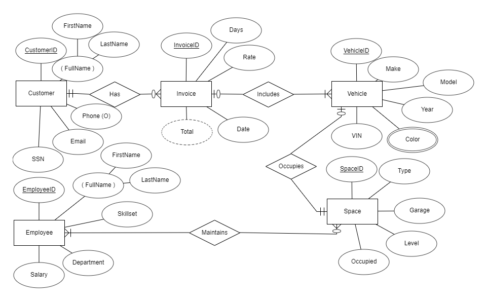

# Database Project

This project provides an overview of database and database management system concepts, including internal design models, normalization, network data models, development tools, and applications.

## Project Components

The project includes:

1. 5 entities (tables)
2. Main entity with at least 200 total records (rows)
3. Three other entities with at least 25 or more records (rows)
4. Renamed primary key for each entity
5. Use of various occurrences of derived, multivalued, composite, and optional attributes in all entities
6. Data integrity measures
7. Forms for each entity, with the largest entity (200 records) having an advanced form
8. Valid and accurate relationships among tables
9. 10 named queries
10. 10 named reports
11. Appropriately named tables, fields, queries, reports, etc.

## PowerPoint Presentation

The accompanying PowerPoint presentation covers:

1. Purpose of the database
2. Relationships between entities
3. Steps taken to verify data integrity
4. Data sources
5. Operations
6. Analytics
7. Entity Relationship Diagram
     ### 
9. Database schema
     ### 
11. Weak entities
12. User-defined constraints
13. Challenges faced

## Goals

The goals of this project are to:

1. Define a database and its uses.
2. Explain the difference between traditional files and databases.
3. Define a database management system (DBMS) and describe its services.
4. Describe the main features of hierarchical, network, and relational database models.
5. Understand the difference between logical and physical design.
6. Model a realistic business application using a technology-independent data model.
7. Design and implement a database using the relational model, with emphasis on data integrity and security.
8. Use the normalization process to refine the relational table definitions.
9. Understand the role of a database administrator.
10. Use data definition and manipulation language, as well as instructions that apply relational algebra.
11. Understand distributed database systems.
12. Evaluate and select an appropriate DBMS for a given application.
